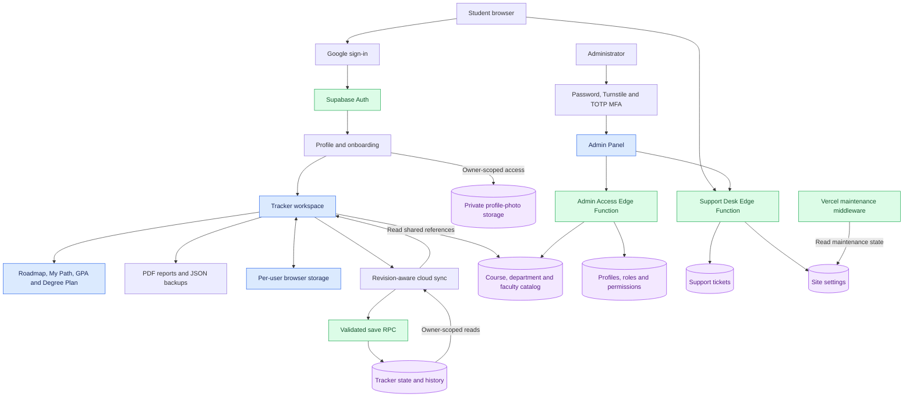

<div align="center">

# BRACU Course Tracker

### Your courses. Your semesters. Your path to graduation.

Plan semesters, follow prerequisites, track grades, and see how your academic progress fits into a degree plan.

[**Open the App**](https://bracu-course-tracker.vercel.app/) · [**Explore Read-only Preview**](https://bracu-course-tracker.vercel.app/index.html?preview=1) · [**Getting Started**](#getting-started)

</div>

> An independent academic planning tool for BRAC University students—not an official university system. The bundled degree plan focuses on **BSc in Computer Science (124 credits)**. Selecting CSE in a profile does not provide a separate, fully validated CSE degree plan.

## At a Glance

| Plan your path | Understand your progress | Keep your work |
| --- | --- | --- |
| Semester planning, course attempts, and prerequisite-aware roadmaps | GPA, CGPA, credit summaries, and category-based Degree Plan | Per-user browser storage, cloud sync, JSON backups, and PDF reports |

**Navigate:** [Features](#features) · [Student Workflow](#student-workflow) · [Technology Stack](#technology-stack) · [Architecture](#architecture) · [Engineering Highlights](#engineering-highlights) · [Setup](#getting-started) · [Security](#security-and-privacy) · [Project Structure](#project-structure)

## Features

### Academic roadmap and personal semesters

- Explore courses through a visual roadmap with hard and soft prerequisites and SVG connections.
- Build **My Path** around your own semesters, rather than a fixed sample schedule.
- Record completed, current, planned, and omitted attempts, including retakes and repeats.
- Associate grades and faculty details with individual course attempts.
- Search and filter your course list by academic status and department.

### Degree Plan and academic performance

- Review progress across general education streams, School Core, Program Core, electives, and the final-year project.
- See completed and remaining requirements alongside course-level status.
- Calculate semester GPA, cumulative CGPA, credits, and overall progress.
- Track repeated attempts separately; the GPA engine selects the highest eligible completed attempt per course, with the newer timestamp resolving equal grade points.

The Degree Plan and GPA views are planning aids based on the application's data and calculation rules. They are not an official degree audit or transcript.

### Shared course catalog

- Search a shared catalog when adding courses to your personal collection.
- Distinguish curriculum courses from additional catalog options.
- Use shared department and faculty records.
- Administrators with the required permission can manage catalog records through server-side operations.

Adding a course to a student's collection is different from changing the shared catalog.

### Profiles, reports, and persistence

- Google student sign-in restricted to `@g.bracu.ac.bd`, followed by first-time onboarding.
- Profile fields for student ID, program, starting term, and starting year.
- Google, custom, or no profile photo; custom photos use a private Storage bucket.
- Per-user browser data plus revision-aware Supabase synchronization.
- Validated JSON backup import/export and client-side academic PDF reports.
- A sanitized, read-only preview that does not load personal tracker data from Supabase.

### Administration and support

- Separate administrator sign-in and Admin Panel.
- Password authentication, Cloudflare Turnstile, and TOTP MFA for administrator access.
- Role- and permission-aware account, status, identity, and catalog management.
- Support tickets, status updates, replies, and notification handling.
- Maintenance controls backed by site settings and Vercel middleware.
- Login activity summaries and audit records for supported administrative operations.

### Interface

Responsive layouts, light/dark themes, loading and empty states, keyboard-focusable controls, status announcements, and reduced-motion handling are included throughout the interface.

## Student Workflow

1. **Explore:** open the read-only preview to inspect the interface.
2. **Sign in:** use your official BRAC University Google account.
3. **Set up your profile:** supply the required academic details.
4. **Build your path:** add semesters and course attempts, grades, and faculty.
5. **Review:** check the roadmap, prerequisites, GPA/CGPA, and Degree Plan.
6. **Preserve your progress:** check sync status, export a JSON backup, or download a PDF report.

## Technology Stack

The browser application uses **HTML, CSS, and vanilla JavaScript**. TypeScript is used in server-side Edge Functions and deployment middleware; Node.js powers local tooling and tests.

<table>
<tr>
<td align="center"><br><strong>HTML</strong><br>Pages &amp; forms</td>
<td align="center"><br><strong>CSS</strong><br>Layout &amp; themes</td>
<td align="center"><br><strong>JavaScript</strong><br>Frontend logic</td>
<td align="center"><br><strong>TypeScript</strong><br>Server-side code</td>
<td align="center"><br><strong>Supabase</strong><br>Auth, API &amp; storage</td>
<td align="center"><br><strong>PostgreSQL</strong><br>Data, RPCs &amp; RLS</td>
</tr>
<tr>
<td align="center"><br><strong>Vercel</strong><br>Hosting &amp; middleware</td>
<td align="center"><br><strong>Cloudflare</strong><br>Turnstile verification</td>
<td align="center"><br><strong>Node.js</strong><br>Local server &amp; tests</td>
<td align="center"><br><strong>Deno</strong><br>Edge Function runtime</td>
<td align="center"><br><strong>Git</strong><br>Version control</td>
<td align="center"><br><strong>GitHub</strong><br>Repository hosting</td>
</tr>
</table>

| Supporting library or service | Purpose |
| --- | --- |
| Google Identity Services | Student Google sign-in; the returned ID token is exchanged through Supabase Auth |
| Supabase JavaScript client | Auth sessions, database/RPC requests, Storage, and Edge Function calls |
| Lucide | Interface icons |
| Three.js + Vanta.js | Authentication-page animated background |
| html2pdf.js | Client-side PDF reports; bundled locally |
| Web3Forms | Support notification integration when server-side configuration is provided |

Technology logos are served by [Skill Icons](https://github.com/tandpfun/skill-icons). Labels remain readable if external images cannot load. Logos identify technologies and do not imply endorsement.

## Architecture

The diagram separates personal tracker data, shared reference data, and privileged operations.



*Authorization is enforced by the relevant server operations and database policies. Arrows describe application flows, not unrestricted access.*

### Engineering Highlights

**Domain logic is separate from rendering.** GPA selection, prerequisite evaluation, catalog normalization, and Degree Plan calculations live in dedicated modules.

**Sync is revision-aware.** Tracker saves include an expected cloud revision. If another device has changed the record, the application preserves the local copy and reports a conflict rather than silently treating the stale save as successful. Local fallback is not a guarantee of a fully offline application.

**Academic calculations use individual attempts.** The basic GPA calculation is:

```text
GPA = sum(counted course credits × grade point) / sum(counted course credits)
```

Attempt eligibility and retake selection determine which records enter that calculation. A planned course is not a completed degree requirement.

**Preview and authenticated use are distinct.** Preview uses sanitized sample state and disables editing and personal cloud synchronization.

**Maintenance is checked before public pages are served on Vercel.** Middleware reads the maintenance setting and redirects when maintenance is active or the check fails. Administrator entry, maintenance, and legal pages have explicit exemptions.

## Getting Started

### Local preview

Install a current supported Node.js release, then:

```bash
git clone https://github.com/sk-reyad/bracu-course-tracker.git
cd bracu-course-tracker
node scripts/dev-server.js 4173
```

Open [localhost:4173/index.html?preview=1](http://localhost:4173/index.html?preview=1).

The local server uses Node's built-in modules; no frontend build step is required for preview. External fonts and browser libraries may still need an internet connection.

| Page | Local address |
| --- | --- |
| Student sign-in | [auth.html](http://localhost:4173/auth.html) |
| Read-only preview | [index.html?preview=1](http://localhost:4173/index.html?preview=1) |
| Authenticated tracker | [index.html](http://localhost:4173/index.html) |
| Admin Panel | [admin.html](http://localhost:4173/admin.html) |

Serve the application over HTTP rather than opening the HTML through `file://`. The lightweight local server does not emulate Vercel middleware.

### Authenticated deployment

> [!WARNING]
> The repository contains deployment-specific configuration. For a separate installation, configure **your own Supabase project and authentication settings** before using authenticated pages. Do not run migrations or tests against somebody else's production project.

Review [the setup guide](docs/SETUP.md), [Supabase migrations](supabase/migrations), and [Edge Function source](supabase/functions) together. The setup guide contains project-specific examples and an older migration checklist; it is not a complete, current one-command installer.

A deployment requires:

1. Browser-safe configuration in `js/config.js`.
2. The applicable database migrations, reviewed in filename order against the target project's migration history.
3. Google provider settings, signup/access-token hooks, and approved origins and redirects.
4. Private profile-photo storage and the matching access policies.
5. Deployed `admin-access` and `support-desk` functions with their server-side settings.
6. Turnstile configuration and a deliberately provisioned initial Super Admin.
7. Vercel environment variables `SUPABASE_URL` and `SUPABASE_PUBLISHABLE_KEY`, followed by authentication and maintenance verification.

Do not blindly replay migrations on an existing database. Back up important data, review the target project, and keep manual reset scripts and disposable test fixtures out of deployment steps.

## Testing

Run the Node.js tests from the repository root:

```bash
node --test tests/*.test.js
```

The test files cover application logic and integration contracts, including access control, authentication, catalog handling, prerequisites, Degree Plan, profiles, support, MFA checks, UI states, and deployment hygiene.

Passing local tests does not certify a hosted deployment. Live authentication, configured permissions, storage access, and cross-user isolation require separate checks in a controlled environment. Use synthetic data and disposable accounts for write tests.

## Security and Privacy

- **Student boundaries:** tracker and history access use owner-scoped database policies and active-account checks; writes go through a validated save RPC.
- **Private photos:** the `profile-photos` bucket and policies scope object access to the relevant user's folder.
- **Privileged actions:** administrative operations require server-side identity, account-status, permission, and applicable MFA checks. Hiding a button is not authorization.
- **Browser configuration:** publishable keys and site keys are public configuration—not replacements for access policies.
- **Secrets:** never commit database passwords, service-role/secret keys, OAuth client secrets, Turnstile secrets, or administrator credentials.
- **Local copies:** browser storage and exported backups contain personal academic information. Protect shared devices and backup files accordingly.
- **Deployment headers:** `vercel.json` defines CSP and other browser security headers.

These are implemented controls, not a claim that every deployment or endpoint has been exhaustively audited. A limited isolation test is not a complete production security certification.

## Project Structure

```text
bracu-course-tracker/
├── index.html                  # Student tracker
├── auth.html                   # Student and administrator entry
├── admin.html                  # Administrative workspace
├── maintenance.html            # Maintenance experience
├── error.html                  # Error page
├── privacy.html / terms.html   # Legal pages
├── css/                        # Themes and page/component styles
├── js/
│   ├── app.js / app-boot.js    # Rendering, startup and sync
│   ├── data.js / catalog.js    # Bundled data and shared catalog
│   ├── degree-plan*.js         # Requirement data, calculation and view
│   ├── gpa.js                  # Attempt selection and GPA
│   ├── prerequisites.js        # Eligibility and course status
│   ├── roadmap.js              # Roadmap rendering
│   ├── storage.js              # Browser state and JSON backups
│   ├── profile.js              # Profiles and avatars
│   ├── auth*.js / access.js    # Authentication and access handling
│   ├── admin*.js               # Accounts, catalog and support UI
│   ├── support-*.js            # Support workflow
│   ├── report-pdf.js           # Academic reports
│   └── vendor/                 # Bundled PDF library
├── shared/                     # Shared password policy
├── supabase/
│   ├── functions/              # Admin and support backend operations
│   └── migrations/             # Schema, RPCs, policies and hardening
├── scripts/                    # Local server and catalog import tools
├── tests/                      # Automated checks
├── docs/                       # Setup and engineering documentation
├── middleware.ts               # Vercel maintenance checks
└── vercel.json                 # Hosting routes and security headers
```

## Possible Next Steps

These are ideas, not implemented features or delivery commitments:

- Class routines and section planning with time-conflict detection.
- Versioned degree plans for additional programs.
- Permission-controlled, advisor-friendly progress sharing.
- Broader end-to-end browser coverage of student and administrator workflows.
- Improved deployment documentation and automation.

## Academic Disclaimer

Curricula, prerequisites, grade rules, course offerings, and graduation requirements can change. Verify academic decisions with current BRAC University guidance and your academic adviser. Reports generated here are personal planning documents, not official university records.

## Author and Contact

**SK Reyad Ali**

[GitHub](https://github.com/sk-reyad) · [LinkedIn](https://www.linkedin.com/in/sk-reyad/) · [Email](mailto:skreyad2016@gmail.com)
