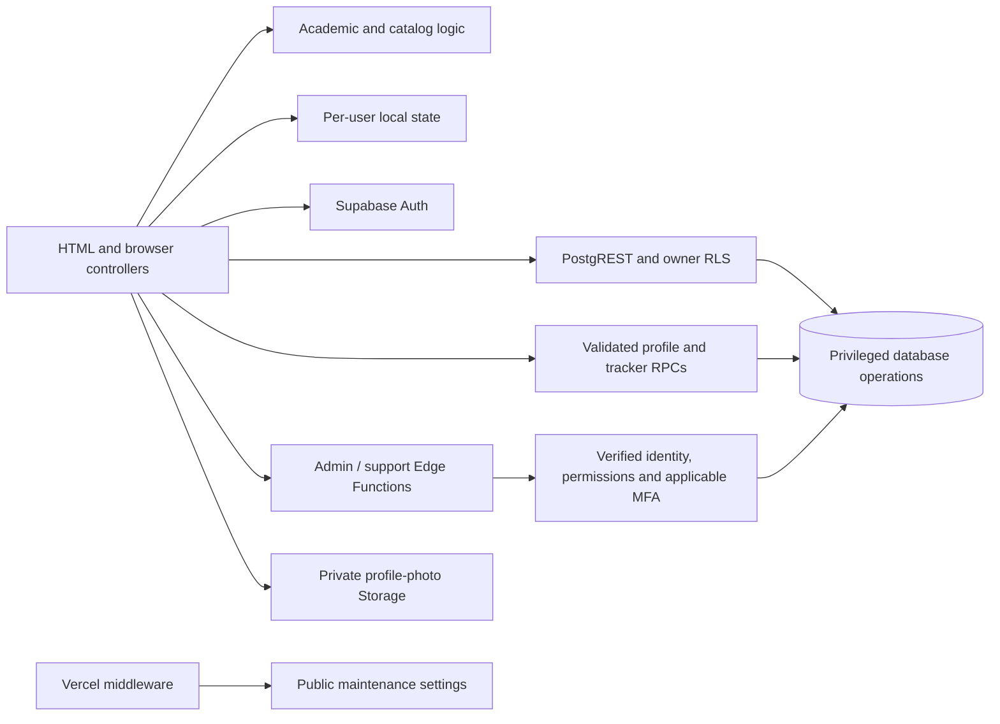

# ARCHITECTURE

## Document contract

- Purpose: Runtime ownership and change-location map.
- Read this when: tracing flows or changing multiple modules.
- Update this when: entry points, dependency direction, module ownership or data flows change.
- Primary sources of truth: [HTML entry](../index.html), [boot](../js/app-boot.js), [Edge Functions](../supabase/functions), [middleware](../middleware.ts), [CSS](../css).

## System boundaries

Static HTML loads ordered classic scripts, many exposing globals and CommonJS factories for tests. No application bundler or package.json is checked in. Supabase provides Auth, PostgreSQL/PostgREST, RPCs, private Storage and Deno Edge Functions. Vercel serves static pages and maintenance middleware.

Detailed authorization belongs to [Security](SECURITY.md), not frontend conditionals.

## Entry points and stylesheet ownership

All paths in the next two tables are relative to the repository root.

| Entry | Main scripts | Styles / ownership |
| --- | --- | --- |
| index.html; preview=1 | app.js, app-boot.js plus domain/state modules below | css/style.css main layout; css/degree-plan.css scoped requirements view; css/ui-states.css; css/support.css |
| auth.html; mode=admin; step=onboarding; mfa=1 | auth.js, auth-core.js, access.js, profile.js, shared/password-policy.js | css/auth.css; ui-states.css; support.css |
| admin.html | admin.js, admin-permissions.js, admin-catalog.js, admin-support.js | css/admin.css accounts/catalog; css/admin-support.css tickets/maintenance; ui-states.css |
| maintenance.html | maintenance-preview.js, maintenance-guard.js, support-widget.js | css/maintenance-preview.css foundation; css/maintenance.css refinements; support.css |
| privacy.html / terms.html | motion.js, maintenance-preview.js (shared theme handling) | css/legal.css |
| error.html | ui-states.js, motion.js, maintenance-guard.js and its dependencies | css/ui-states.css |

Auth also loads Google Identity Services, Turnstile, Three.js and Vanta. Supabase JS and Lucide are remote libraries; PDF generation is bundled under js/vendor. Script order matters: degree-plan-data before data; catalog/storage before boot; pure academic helpers before app orchestration.

## JavaScript responsibility map

Files below are in [js/](../js). Change the owner rather than duplicating its logic in app.js.

| Module | Kind; dependencies / consumers | What belongs here; what does not |
| --- | --- | --- |
| config.js | Public configuration consumed by client/controllers | Public URLs/site keys; never privileged secrets |
| supabase-client.js | Auth/network factory; config + SDK; access/controllers consume it | Singleton client, session context, AAL, login metric RPC; not business calculations |
| access.js | Page access orchestration; client; boot/admin | Redirects and preview branch; not authoritative server permissions |
| auth-core.js | Pure auth validation; auth.js | Domain/identity/form helpers; not DOM |
| auth.js | Auth rendering/controller; auth-core/client/profile/password policy | GIS ID token, password/Turnstile, onboarding and TOTP UX |
| profile.js | Profile mapping/network/image handling; Auth + Storage + RPC | Canonical identity, avatar validation/compression/persistence; not direct unrestricted profile writes |
| data.js | Bundled reference/sample state; degree-plan-data; storage/preview | Default courses, faculties, grades and settings; not live user records |
| catalog.js | Normalization/merge/search/equivalence + catalog fetch; boot/app/admin | Shared catalog rules; no privileged client writes |
| storage.js | State migration/local persistence/backup; profile/catalog/default data | Keys, load resolution, compatibility; not DOM or service credentials |
| preview.js | Sample state and mutation lockdown; default data/access/boot | Sanitization and read-only UX; no personal cloud loading |
| gpa.js | Academic calculation; state/default data; app/roadmap | Attempt selection and GPA; no network |
| prerequisites.js | Pure eligibility; GPA helpers + catalog alternatives | Hard/soft rules; no rendering |
| degree-plan-data.js | Shared requirement definitions/aliases; importer/data/engine | Approved membership and reference definitions; no user state |
| degree-plan.js | Pure allocation; degree-plan-data; view/roadmap | Requirements, elective/alternative allocation; no DOM/network |
| degree-plan-view.js | Render/interaction; degree-plan calculation results; app | Escaped requirement markup/navigation; not independent grade rules |
| roadmap.js | Derived display and SVG rendering; GPA/prerequisites/degree plan | Roadmap slots/connectors; not persistence |
| app.js | High-coupling DOM/state orchestrator; above modules | Event wiring, views, edits, save calls; delegate reusable rules |
| app-boot.js | Boot/network/sync factory; access/storage/catalog/preview | Load order, serialized/debounced RPC saves; not UI calculations |
| report-pdf.js | PDF adapter; html2pdf; app | A4 portrait options/download; not grade calculation |
| admin-permissions.js | Client permission model; admin | UI choices and restrictions; not server authorization |
| admin.js | Admin accounts controller; access/client/permission helpers | Lists, dialogs, request lifecycle; no direct privileged SQL |
| admin-catalog.js | Catalog admin rendering; catalog/client | Shared reference editors using admin-access |
| admin-support.js | Support/admin maintenance controller; client | Ticket actions using support-desk |
| support-core.js | Pure validation/destination helpers; widget/guard | Support shape and maintenance route rules |
| support-widget.js | Support UI/network; core/client | Guest challenge, submit/history; no secrets |
| maintenance-guard.js | Browser network guard; client/core | Public setting read; fail-open on lookup failure |
| maintenance-preview.js | DOM theme/retry helper; maintenance/legal | Shared theme toggle and explicit retry, despite historical filename |
| motion.js | Shared visual enhancement | Dot-grid/motion/interaction lifecycle; not application state |
| ui-states.js | Error/loading models and renderer | Allow-listed safe messages/routes, skeleton lifecycle |

## End-to-end flows

1. **Boot:** app wiring starts BracuTrackerBoot → requireMainAccess → preview short circuit or session/profile checks → tracker row read → storage load resolution → fetch/merge shared catalog → initialize app. Cloud-read failure avoids automatic startup sync.
2. **Save:** app changes local state → storage saves user copy → boot marks pending/debounces and serializes saves → save_course_tracker_state(expected revision, data, destructive flag) → update sync metadata. A conflict preserves local work; SQL enforces ownership independently.
3. **Student auth/profile:** GIS returns ID token → signInWithIdToken → profile/access context → onboarding RPC. Custom avatar becomes a unique user-folder WebP object; profile RPC validates path/ownership, and failed persistence cleanup is handled in profile.js.
4. **Academic views:** state → GPA attempts and prerequisite checks → roadmap; state + requirement definitions → Degree Plan allocation → degree-plan-view. PDF exports the prepared report DOM through html2pdf.
5. **Catalog:** authenticated column-selected reference reads → catalog merge preserves user records/attempts. Admin editor → admin-access validation/AAL2/permission → mutate_global_catalog service-only RPC with atomic audit. Workbook import is an offline SQL generator, not a browser feature.
6. **Administration:** verified admin page context → action request → server verifies token/AAL2/active profile/permission → privileged account helpers with target guards/rate limits/audit.
7. **Support:** widget → support-desk; public maintenance and submit paths are distinct from active own-ticket reads and MFA-gated administrative actions. Guest replies produce mailto links; notifications use Web3Forms, not a guaranteed automatic outbound reply service.
8. **Maintenance:** Vercel checks public setting before matching GET/HEAD routes and fails closed to maintenance; browser guard fails open on lookup error. Maintenance retry explicitly navigates to index, avoiding an automatic redirect loop.

## Backend modules and operational boundaries

- [admin-access/index.ts](../supabase/functions/admin-access/index.ts): authentication/dispatch. account-list.mjs owns bounded listing; account-policy.mjs owns target visibility; account-actions.mjs owns identity/role/status/create/delete flows; admin-rate-limit.mjs owns limits; catalog-actions.mjs owns catalog validation/RPC calls; http-response.mjs owns responses.
- [support-desk/index.ts](../supabase/functions/support-desk/index.ts): public/student/admin branches, submission limits and owner notification.
- [_shared](../supabase/functions/_shared): public-error allow-list and JWT assurance extraction. Decoding the JWT is not signature verification.
- [scripts/catalog-import.mjs](../scripts/catalog-import.mjs): derives SQL using catalog-source-config.mjs and catalog-workbook-reader.mjs. The workbook reader depends on an optional external package; see [Known issues](KNOWN_ISSUES.md).
- [shared/password-policy.js](../shared/password-policy.js) and the function-side password-policy.js must stay aligned; password-policy tests protect parity.

## Change-location guide

| Change | Start | Related files | Review / tests |
| --- | --- | --- | --- |
| Grade/retake | js/gpa.js | degree-plan.js, prerequisites.js, roadmap.js | PROJECT; degree-plan, prerequisites, main-integration tests |
| Sync/data loss | js/storage.js | app-boot.js, migration 022 | DATA_MODEL, SECURITY; access/security tests |
| Catalog identity | js/catalog.js | degree-plan-data.js, import scripts, catalog-actions.mjs | DATA_MODEL; catalog/catalog-import/faculty tests |
| Authentication | js/auth.js | auth-core.js, access.js, hooks | SECURITY; auth/access/security tests |
| Admin action | function admin-access/index.ts | account helpers, admin.js | SECURITY; admin/security tests |
| Layout/state | owning CSS + HTML | motion.js/ui-states.js | DESIGN; interaction/motion/ui-states tests |
| Support | support-desk/index.ts | support-widget/admin-support | SECURITY; support-core/support-mfa/maintenance-support tests |

See [Testing](TESTING.md) for exact filenames/commands and [Design](DESIGN.md) for visual ownership.

