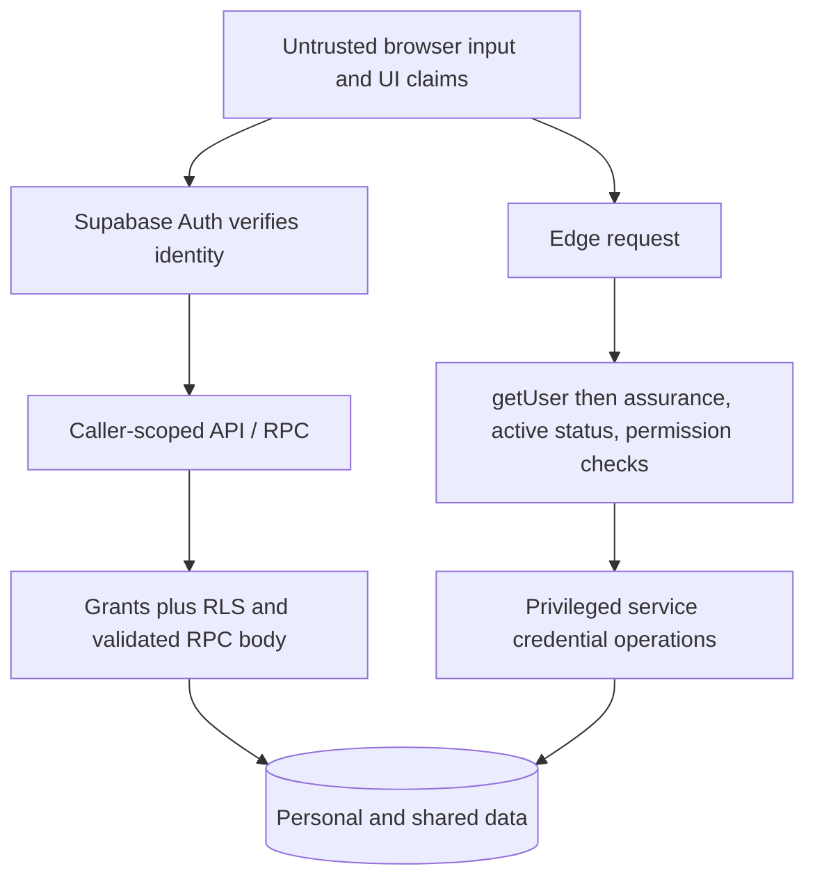

# SECURITY

## Document contract

- Purpose: Trust, identity and authorization boundaries.
- Read this when: changing auth, profiles, admin/support, SQL access, storage or deployment security.
- Update this when: permissions, enforcement, secrets, data exposure or failure behavior change.
- Primary sources of truth: [Auth](../js/auth.js), [access](../js/access.js), [migrations](../supabase/migrations), [admin handler](../supabase/functions/admin-access/index.ts), [support handler](../supabase/functions/support-desk/index.ts), [headers](../vercel.json).

## Scope and objectives

Preserve private-user isolation, canonical identity, permission-controlled privileged actions and browser/server secret separation. These are design controls, not a global security certification. This document is based on local implementation; hosted settings and applied migrations need independent verification.

Public support branches are explicit exceptions to the authenticated Edge flow; see below.

## Identities and authentication

Application roles: student, admin, super_admin. Profile account states: pending, active, suspended. auth.users establishes identity; public role/permission/profile tables determine access. User permission overrides take precedence over defaults. Token claims support UI routing but are not a replacement for current server authorization.

Students use Google Identity Services and Supabase signInWithIdToken. The Google hd hint is not enforcement: hook_restrict_signup and student profile RPCs validate the provider/domain. Onboarding requires pending/not-completed student state, program/term/year constraints and valid avatar ownership. Student name/email cannot be altered through self-service profile mutation.

Browser sessions persist/refresh through the Supabase SDK. Treat tokens, MFA QR/secret and exported storage as sensitive. Authenticated user verification differs by caller; never present decoded JWT payloads as signature verification.

Administrators use password + Auth CAPTCHA and TOTP challenge/enrollment. Shared password policy and Supabase config require at least 12 characters with upper/lowercase, digit and symbol. AAL2 protects the Admin Panel and admin-access server handler. No public admin registration flow exists.

## Admin request enforcement

admin-access requires an allowed Origin and POST (OPTIONS is preflight), bearer token verified by auth.getUser, AAL2, active profile and authorize(required permission). Only then is the service client constructed. It re-reads actor effective access and applies target/role guards, rate limits and audit handling.

| Action | Permission |
| --- | --- |
| list-accounts | users.read for students; admins.read for administrator list, selected by account policy |
| get-profile-summary | profiles.read plus target-role visibility guard |
| create-admin / update-admin-identity | admins.manage; additional actor/target restrictions |
| update-user-identity | users.identity.manage |
| set-account-status | users.status.manage |
| delete-account / set-role / set-user-permissions | permissions.manage; Super Admin/last-active safeguards as applicable |
| list-catalog / upsert-catalog-item / delete-catalog-item | catalog.manage |

Do not equate these permissions with unrestricted target access. Read account-policy.mjs/account-actions.mjs and guarded SQL when changing a target rule. Last active Super Admin demotion/suspension is protected with transactional locking; deletion has separate safeguards.

Admin limits: create-admin/delete-account/update-admin-identity → 5 per 600 seconds; other supported mutation actions → 20 per 300 seconds. Limits are actor/action based. Reads are not covered by this limiter. Rate-limit errors return 429 with Retry-After. SQL catalog mutation and successful audit are atomic; not all Auth/API mutations and audit inserts form one transaction.

## Support branches and limits

supabase/config.toml explicitly sets support-desk verify_jwt=false because public actions exist. This is **not** permission to remove handler authentication. admin-access has no corresponding local override; gateway behavior must also be verified on deployment.

| Branch | Enforcement |
| --- | --- |
| get-maintenance | Public setting response |
| submit-ticket, guest | Input/honeypot checks, Turnstile success + action=support_ticket + Origin hostname, rate limits |
| submit-ticket, authenticated | getUser and canonical profile identity; intentionally does not require AAL2 or active-account guard |
| list-my-tickets | Verified active user; requester_user_id filter |
| list-tickets | Verified active user, AAL2, support.read |
| update-status/add-reply/update-reply/resend-notification | Verified active user, AAL2, support.manage |
| set-maintenance | Verified active user, AAL2, maintenance.manage |

A malformed/invalid optional token falls back to the guest challenge path. Submission limits are 3 per identity and 10 per IP per 60 seconds, using hashed rate keys. Privileged support mutations do not use the admin-access mutation limiter. Guest reply delivery is mailto; Web3Forms notifies the owner, and a failed notification does not remove the ticket.

Support constructs its service client before branching, so every nonpublic branch's gates and query scope are critical. Unlike admin-access, a missing Origin falls back to the first configured origin. CORS is not authorization, and request headers are not independent proof of identity.

## Database and storage

[Data model](DATA_MODEL.md) owns the effective RLS/grant matrix. Important boundaries:
- Own active tracker/history SELECT; writes only through owner-derived save RPC, not browser table CRUD.
- Own pending/active photo-folder policies; bucket private. Private bucket does not prevent an authorized client from deliberately creating other access mechanisms; signed-URL behavior needs separate review.
- Student profile direct UPDATE revoked; validated RPCs retain controlled writes.
- Administrative cross-user policies add AAL2 in migration 015.
- Internal admin/rate/catalog mutation helpers are service-only; Auth hooks are supabase_auth_admin-only.
- Definer functions require fixed search paths and narrow EXECUTE grants.
- TRUNCATE hardening is scoped, not a statement that all database/platform grants are safe.

Audit rows can include before/after identity information; support tickets contain names/emails/messages; login events include session identifiers. Do not copy them into docs or troubleshooting logs.

## Configuration classification

| Name / location | Classification and handling |
| --- | --- |
| BRACU_CONFIG.supabaseUrl, supabasePublishableKey | Browser-public endpoint/key; enforcement still relies on RLS/server checks |
| googleClientId, turnstileSiteKey | Browser-public provider/widget identifiers |
| authPageUrl, appPageUrl, adminPageUrl, errorPageUrl | Public routing configuration |
| SUPABASE_URL | Public endpoint, also a server deployment setting |
| SUPABASE_PUBLISHABLE_KEY | Vercel middleware public key setting; singular |
| SUPABASE_PUBLISHABLE_KEYS / SUPABASE_ANON_KEY | Edge key map / legacy public-key fallback |
| SUPABASE_SECRET_KEYS / SUPABASE_SERVICE_ROLE_KEY | Server-only privileged map / legacy secret fallback |
| ALLOWED_ORIGINS | Edge deployment setting, comma-separated exact origins |
| TURNSTILE_SECRET_KEY | Server-only support verification credential; Auth CAPTCHA also needs dashboard secret configuration |
| SUPPORT_RATE_LIMIT_SALT | Server-only rate-key salt; code falls back to Turnstile secret then a static value |
| WEB3FORMS_ACCESS_KEY | Keep server-side; support notification credential |
| Google OAuth client secret, database password, CLI access token | Provider/database/deployment secrets, not browser fields |

Use placeholders in examples. Do not expose values to validate whether a setting exists.

## Web/platform controls and failure behavior

vercel.json configures CSP (self plus explicit Google/CDN/Turnstile boundaries), HSTS, nosniff, DENY framing, referrer policy, permissions policy, same-origin-allow-popups COOP and no cross-domain-policy files. CSP permits inline styles and HTTPS images; do not describe it as a strict self-only policy.

Vercel maintenance middleware only processes GET/HEAD matches and fails closed on missing config, unavailable/invalid settings or 1.8-second timeout. Browser maintenance guard fails open on errors. Neither maintenance mechanism replaces API authorization.

Shared public-error helper exposes allow-listed messages and otherwise Request failed. UI error state normalizes code/source and avoids arbitrary query-provided error HTML. Preserve escaping when rendering user-owned strings.

## Prohibited patterns and review checklist

Never put privileged keys in browser code, disable RLS to fix UI, authorize by hidden buttons, accept client role/owner values as authority, broaden PUBLIC grants without review, or log tokens/passwords.

For a sensitive change:
1. Identify attacker-controlled fields, affected user class and cross-user target.
2. Trace getUser, active account, AAL and permission checks before privileged operation.
3. Inspect direct Data API/RPC alternatives, grants, RLS and search_path.
4. Check errors, rate-limit scope, Origin behavior, escaping, object paths and logs.
5. Run negative tests: invalid identity, AAL1, inactive, missing permission and other owner.
6. Report reviewed scope and residual gaps, not "secure".

Use [security-review](../.agents/skills/security-review/SKILL.md), [Testing](TESTING.md) and [Deployment](DEPLOYMENT.md).
